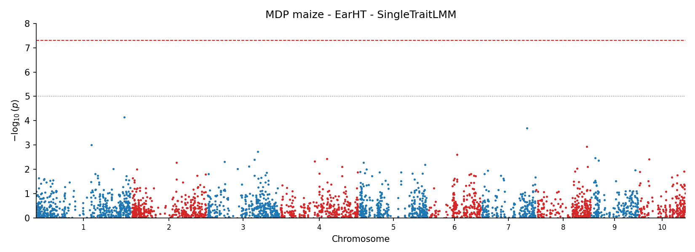

# TorchGWAS

[](https://pypi.org/project/torchgwas/)
[](https://pypi.org/project/torchgwas/)
[](LICENSE)
[](tests/)
[](#status)

**GPU-accelerated Genome-Wide Association Studies with PyTorch.**

TorchGWAS is a modular Python library for running GWAS on CPU or GPU. It
replicates GEMMA and GAPIT to the 4th decimal on shared benchmarks, then
extends the feature surface with novel mixed-model variants, post-GWAS
analyses, haplotype tests, polygenic scoring, and causal mediation — all in a
single `pip install`.

<p align="center">
  
  <br/>
  <em>Example output from <code>examples/python/01_single_trait_lmm.py</code>
  (MDP maize Ear Height, SingleTraitLMM, 276 samples × 3093 SNPs).</em>
</p>

## Status

**v0.2.0 · Alpha · 2402 tests collected · Python 3.10 – 3.12 · Linux, Windows, macOS**

V1 core (Phases 0 – 13) delivers GEMMA / GAPIT reference equivalence for
Gaussian single- and multi-trait GWAS. Post-V1 extensions implemented through
Phase 49b cover GLM / GLMM, survival, multi-environment, haplotype, threshold-
linear, polygenic scoring, fine-mapping, post-GWAS, and causal mediation.
Golden-data CI pins agreement with GEMMA 0.98.5 on every push.

## Install

```bash
pip install torchgwas             # wheel where available; sdist fallback
pip install "torchgwas[all]"      # + zarr, h5py, pyarrow, seaborn
pip install "torchgwas[dev]"      # + pytest, ruff, mypy (editable development)
pip install "torchgwas[docs]"     # + mkdocs + mkdocs-material + mkdocstrings
```

From source:

```bash
git clone https://github.com/sikiru-atanda/torchgwas.git
cd torchgwas
pip install -e ".[dev]"
pytest tests/ -v
```

GPU support: install the matching PyTorch CUDA wheel first (see
[docs/getting-started/installation.md](docs/getting-started/installation.md)),
then `pip install torchgwas`. The same Python code runs on CPU or CUDA by
changing one tensor device.

## Quickstart

```bash
torchgwas lmm-scan \
  --genotype benchmark/data/mdp_numeric.txt \
  --map benchmark/data/mdp_SNP_information.txt \
  --phenotype benchmark/data/mdp_traits.txt \
  --trait EarHT --test wald --correction bh \
  --output results/mdp_earht
```

The equivalent Python (trimmed; full script at
[`examples/python/01_single_trait_lmm.py`](examples/python/01_single_trait_lmm.py)):

```python
import pandas as pd
import torch

from torchgwas.config import STAT_DTYPE, NumericalConfig
from torchgwas.models import SingleTraitLMM, VariantMeta
from torchgwas.stats import benjamini_hochberg

geno = pd.read_csv("benchmark/data/mdp_numeric.txt", sep="\t")
pheno = pd.read_csv("benchmark/data/mdp_traits.txt", sep="\t")

# ... sample alignment / missing imputation (see examples/python/01) ...

G = torch.tensor(geno.values, dtype=STAT_DTYPE)
Y = torch.tensor(pheno["EarHT"].values, dtype=STAT_DTYPE).unsqueeze(1)
X0 = torch.ones(G.shape[0], 1, dtype=STAT_DTYPE)
K = torch.tensor(pd.read_csv("gemma_demo/output/mdp_kinship.cXX.txt",
                             sep="\t", header=None).values, dtype=STAT_DTYPE)
vmeta = VariantMeta(snp=list(geno.columns), chr=chrs, pos=pos,
                    a1=["A"] * G.shape[1], a2=["G"] * G.shape[1])

model = SingleTraitLMM(config=NumericalConfig(reml_method="emma"))
nf = model.fit_null(Y, X0, K=K)
result = model.score_chunk(G, nf, vmeta, test="wald")

fdr = benjamini_hochberg(result.p.cpu())
```

## Learn more

- [**Docs site**](https://sikiru-atanda.github.io/torchgwas/) — installation,
  tutorials, full API reference, and validation protocol. Built with MkDocs
  Material; deployed on pushes to `master` / `main`.
- [**examples/python/**](examples/python/) — 10 working end-to-end scripts
  (single/multi-trait LMM, MET, threshold-linear, PGS, SuSiE fine-mapping,
  mediation, NCBI annotation, polyploid, haplotype).
- [**examples/notebooks/quickstart.ipynb**](examples/notebooks/quickstart.ipynb)
  — same as example 01 but renders the Manhattan inline.
- [**docs/cli.md**](docs/cli.md) — every CLI subcommand with expected inputs.
- [**docs/validation.md**](docs/validation.md) — GEMMA / GAPIT agreement tables.
- [**docs/ROADMAP.md**](docs/ROADMAP.md) — deferred internal improvements and
  candidate Phase 50+ features.

## Features

### GWAS models
- **Classical**: GLM, single-trait LMM, multi-trait LMM (MVLMM), FarmCPU, BLINK
- **Multi-environment**: MET (reaction-norm, FA(k), multi-kernel), MT-MET (Kronecker separable)
- **Novel LMMs**: Multi-kernel, GxE/heteroscedastic, orthogonal cross-fit (DML), knockoff FDR-controlled, genotype-uncertainty, leave-region-out LOCO
- **Categorical traits**: Binary/ordinal/multinomial GLM and GLMM (PQL, SPA), multi-environment GLMM
- **Survival**: Cox PH frailty with Breslow-Clayton PQL and SPACox SPA
- **Longitudinal**: Random regression LMM with Legendre / B-spline bases, spatio-temporal 2D P-spline, RR-MET
- **Haplotype-based**: HTR, block, window, SKAT, plus novel methods (PCHT, HHCT, HSKAT, HapGxE, BayesHap); multi-env / multi-trait haplotype GWAS
- **Fine-mapping**: SuSiE (IBSS) and CAVI Bayesian variable selection
- **LD-conditional**: COJO-style stepwise conditioning with persistence metrics
- **Within-family**: Dual-scan attenuation diagnostics for confounding detection
- **Threshold-linear**: Bermann et al. 2026 for mixed ordinal + continuous traits

### Polyploid support
- Arbitrary ploidy (diploid through hexaploid+)
- Gene-action models: additive, 1-dom through (k−1)-dom, diplo-additive, overdominant, general
- HWE testing with double-reduction correction for autopolyploids

### LD block detection
- 13 methods across 4 categories (classical / literature / novel / diagnostic)
- PLINK 1.9 `--blocks` validated (Jaccard ≥ 0.78 for Gabriel)
- Diploid and polyploid compatible

### Post-GWAS
- **Heritability**: LDSC h² / rg, S-LDSC partitioned, HESS regional
- **Meta-analysis**: IVW, DerSimonian-Laird, Stouffer, RE2, MR-MEGA, MANTRA
- **Colocalization**: Giambartolomei coloc, HyPrColoc multi-trait
- **Mendelian randomization**: IVW, MR-Egger, weighted median, MR-PRESSO
- **SMR / HEIDI** and **TWAS** (S-PrediXcan / PrediXcan)
- **Gene-set enrichment**: MAGMA-style SNP-to-gene + competitive enrichment
- **LD clumping**, **fine-mapping utilities**, **power analysis**, **winner's curse correction**

### Polygenic scores
- C+T (clumping and thresholding), LDpred2 (Inf / Grid / Auto), PRS-CS
- Allele harmonization, individual scoring, PGS validation metrics

### Visualization
- Manhattan (linear and Circos-style polar), Miami, QQ with λ_GC
- Haploview-style LD triangle heatmap, trumpet plot

### Multi-omics
- GRM-corrected causal mediation (single triple + GPU-batched scan + gene-set Wald)
- Multi-kernel heritability; eigenMT FDR; colocalisation prefilter

### Performance
- 24 native C++ extension modules via pybind11 (up to ~12 000× speedup on hot kernels)
- OpenMP parallelization where measured beneficial
- GPU kernels for imputation (mode, KNN, LD-based)
- Three-tier dispatch: GPU > native C++ > Python (automatic fallback)
- AMP (FP16 / BF16) for I/O and GRM; FP64 mandatory for statistical inference

### Multiple testing
- Bonferroni, Holm, BH, BY, Storey q-value, simpleM / M_eff
- GPU-accelerated permutation, Cauchy combination, local FDR
- IHW (covariate-adaptive weighting), AdaPT (covariate-adaptive thresholding)

## Architecture

```
torchgwas/
  io/          Format detection & readers (PLINK, VCF, BGEN, HapMap, Zarr, CSV)
  preprocess/  Imputation (built-in + BEAGLE/IMPUTE5/Minimac4), QC, standardization
  linalg/      GRM (diploid + polyploid), eigendecomposition, batched Cholesky
  models/      All GWAS models (BaseModel protocol: fit_null + score_chunk)
  scan/        UnifiedScanner streaming chunks through any model
  stats/       Multiple testing, SPA, PVE
  ld/          LD block detection (13 methods), pairwise LD (r², D', CI)
  optim/       6-mode optimizer stack (PX-EM → AI-REML → ... → derivative-free rescue)
  pgs/         PGS construction & validation
  postgwas/    LDSC, meta-analysis, coloc, MR, TWAS, enrichment
  multiomics/  GRM-corrected mediation + multi-kernel heritability
  annotate/    NCBI Datasets v2 + E-utilities gene annotation
  viz/         Manhattan, QQ, Miami, Circos, Haploview, trumpet plots
  _native/     24 C++ pybind11 extension modules + GPU kernels + select_path dispatcher
  cli.py       40 CLI subcommands
```

Data flow: **Format detection → Imputation / phasing → QC → Genotype encoding
→ GRM → Eigendecomposition → Null fitting → Scan loop → Multiple testing →
Reporting.**

## Supported genotype formats

| Format | Extension | Read | Write |
|---|---|---|---|
| PLINK BED | `.bed` / `.bim` / `.fam` | ✓ | ✓ |
| PLINK2 PGEN | `.pgen` / `.pvar` / `.psam` | ✓ | — |
| VCF / BCF | `.vcf` / `.vcf.gz` / `.bcf` | ✓ | — |
| BGEN | `.bgen` | ✓ | — |
| HapMap | `.hmp.txt` | ✓ | — |
| Zarr | `.zarr` | ✓ | ✓ |
| CSV dosage | `.csv` | ✓ | — |

## Testing

```bash
LC_ALL=C.UTF-8 LANG=C.UTF-8 TORCHGWAS_DISABLE_NATIVE=1 pytest tests/ -v --tb=short -x -q --timeout=300
LC_ALL=C.UTF-8 LANG=C.UTF-8 TORCHGWAS_DISABLE_NATIVE=1 pytest tests/ -m golden -v --tb=short --timeout=600
```

These are the CPU reference and golden-data validation tiers used by CI.
Native, no-OpenMP, and CUDA validation use separate commands; see
`docs/validation.md`.

## Requirements

Python ≥ 3.10 and < 3.13, PyTorch ≥ 2.0 and < 2.5, NumPy ≥ 1.24 and < 2.0,
pandas ≥ 2.0, SciPy ≥ 1.10, matplotlib ≥ 3.7, requests ≥ 2.28.

Optional: `zarr`, `h5py`, `pyarrow`, `seaborn`. A C++ compiler with pybind11 is
optional; if unavailable, every native path falls back to the pure-torch
reference implementation (`TORCHGWAS_DISABLE_NATIVE=1` forces this).

## License

MIT License — see [LICENSE](LICENSE).

## Citation

```bibtex
@software{torchgwas2026,
  title  = {TorchGWAS: GPU-accelerated Genome-Wide Association Studies with PyTorch},
  author = {Atanda, Sikiru A.},
  year   = {2026},
  url    = {https://github.com/sikiru-atanda/torchgwas},
  note   = {Version 0.2.0},
}
```
